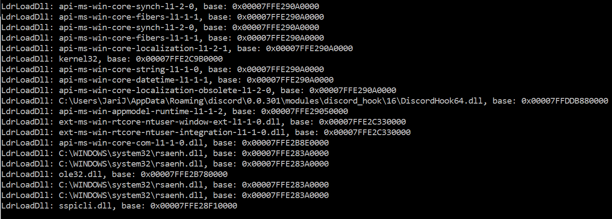

# Introduction

The goal of this project is to provide API usage information about the processes under observation that is written down on a disk. Tools that are somewhat similar are SysInternals Process Monitor and the Rohitab APIMonitor. As a final project work for the OUSPG Computer Security course, I implemented the dll code injection mechanism into the processes and hooking of imported API functions in the target processes. Kernel driver is used to inject the dll and the dll does API hooking. The API function calls are logged into a separate log file for each process. I also looked into how Win32 API functions could be hooked in the kernel.

**The kernel driver should be run in a virtual machine because it may not be 100 % stable and a crash in the driver causes a BSOD and could lead to crashing on a boot and/or file corruption.**

The dll can be injected into the target process using any dll injector.

# Kernel driver

The kernel driver is used to inject the Dll into the target process. Potentially, in the future could also be used to hook kernel functions.

## Developing a Kernel Driver

The driver should be run in a virtual machine. WinDBG can be used as a kernel debugger. The debugger runs on the host machine and a virtual machine can connect to it. `KdPrintEx` is used to show debug messages in the WinDBG console. `!analyze -v` is useful WinDBG command when investigating what caused the crash.

See https://docs.microsoft.com/en-us/windows-hardware/drivers/debugger/setting-up-a-network-debugging-connection for how to setup WinDBG for kernel debugging.

## DLL Injection

When a process creates a new thread the informs drivers using a `CreateThreadNotifyRoutine`. The callback can be registed using the `PsSetCreateThreadNotifyRoutineEx` function. When the notify routine is created as `PsCreateThreadNotifyNonSystem` the callback is executed on a new non-system thread. https://docs.microsoft.com/en-us/windows-hardware/drivers/ddi/content/ntddk/ne-ntddk-_pscreatethreadnotifytype

```c
NTSTATUS status = PsSetCreateThreadNotifyRoutineEx(PsCreateThreadNotifyNonSystem, CreateThreadNotifyRoutine);
if (!NT_SUCCESS(status)) {
    KdPrintEx((DPFLTR_IHVDRIVER_ID, DPFLTR_INFO_LEVEL, "APILogger: Could not register thread notify routine: code %x\n", status));
return status;
}
```

To inject the code into the process the driver has to enter the process address space, copy the code into the process memory and run it. In this case we want to load a DLL, so the code should call LoadLibrary function in the target process with a filepath to our DLL. The injection could also be done by manually mapping the DLL into the process (essentially rewriting LoadLibrary function) in the kernel driver. But because it is a lot of work to do `LoadLibrary` is used instead. This method is discussed in https://wikileaks.org/ciav7p1/cms/page_7995519.html

Control Flow Guard (CFG) has to be disabled. This can be done in the (C++/Code Generation) settings in the VS2017. Otherwise, the `context->load` wouldn't be a direct call to LoadLibrary so the target process would crash trying to call function that only exists in the driver address space. Alternatively, the UserAPC payload could be in assembly. Because the `UserAPC_end` is located after `UserAPC` the UserAPC size can be calculated by substracting the UserAPC from  UserAPC_end function address, because UserAPC_end is after the UserAPC in the memory.

```c++
VOID UserAPC(PLOAD_LIB context, PVOID sysarg1, PVOID sysarg2)
{
    context->load(context->DllName);
}

VOID UserAPC_end()
{}

ULONG CalcApcSize()
{
    return ((ULONG_PTR)UserAPC_end - (ULONG_PTR)UserAPC);
}
```

Because the injected dll supports only 64-bit processses for now the injector checks that the process is 64-bit by calling `IoIs32bitProcess(NULL)`.

In a process loaded modules are stored in the `InLoadOrderModuleList`. Pointer to this list is stored in the PEB structure. Pointer to this is at the 0x60 offset in the TIB structure. This can be accessed using the pointer at `gs:0x30`. Because kernel32 is loaded in the same location in every process so the LoadLibrary address has to be retrieved only once.

```c
ULONG64 tib = __readgsqword(0x30);
PPEB peb = *(PPEB*)(tib + 0x60);

// PE loader hasn't loaded modules yet
if (peb->Ldr == NULL) {
  currentPidCount--;
  KeUnstackDetachProcess(apc);
  ExFreePool(apc);
  return;
}

if (loadLibAddr == NULL) {
  PLDR_DATA_TABLE_ENTRY_LOAD entry = (PLDR_DATA_TABLE_ENTRY_LOAD)peb->Ldr->InLoadOrderModuleList.Flink->Flink->Flink;
  loadLibAddr = GetProcAddress(entry->DllBase, "LoadLibraryA");
}
LOAD_LIB lib = { loadLibAddr, dllFilepath };
```

The following code is used to locate the address of `LoadLibraryA` in the kernel32.dll. It iterates over the export directory and compares export names and then retrieves the address from the corresponding `AddressOfFunctions` entry. `module` is the base address of the loaded image (e.g. address of the PE header).

```c
ULONG64 GetProcAddress(
    _In_ ULONG64 module,
    _In_ const char* name
)
{
    PIMAGE_DOS_HEADER peHdr = (PIMAGE_DOS_HEADER)module;
    PIMAGE_NT_HEADERS hdrs = (PIMAGE_NT_HEADERS)(module + peHdr->e_lfanew);

    IMAGE_DATA_DIRECTORY dataDir = hdrs->OptionalHeader.DataDirectory[IMAGE_DIRECTORY_ENTRY_EXPORT];
    PIMAGE_EXPORT_DIRECTORY exportDir = (PIMAGE_EXPORT_DIRECTORY)(module + dataDir.VirtualAddress);

    for (int i = 0; i < exportDir->NumberOfNames; ++i) {
        const char *funcName = (const char*)(module + *(ULONG32*)(module + exportDir->AddressOfNames + i * 4));
        if (strcmp(funcName, name) == 0) {
            ULONG64 funcAddr = (module + *(ULONG32*)(module + exportDir->AddressOfFunctions + i * 4));
            return funcAddr;
        }
    }
    return NULL;
}
```

After the memory for the APC code and the LOAD_LIB structure has been allocated and copied into the target process the injected code can be executed using APC (Asynchronous Procedure Call).

From [MSDocs](https://docs.microsoft.com/en-us/windows/desktop/sync/asynchronous-procedure-calls):
>When an APC is queued to a thread, the system issues a software interrupt. The next time the thread is scheduled, it will run the APC function.

 `KeInitializeAPC` initializes the APC object and registers routines then it is then queued using the `KeInsertQueueApc` function. See https://doxygen.reactos.org/db/d94/ntoskrnl_2ke_2apc_8c_source.html for full description.

```c
PKAPC apc2 = ExAllocatePool(NonPagedPool, sizeof(KAPC));
KeInitializeApc(apc2, thread, OriginalApcEnvironment, KernelAPC, NULL, apcMem, UserMode, libMem);
KeInsertQueueApc(apc2, NULL, NULL, 0);
```

See CreateThreadNotifyRoutine in [Driver.c](./APILoggerDriv/Driver.c#L135) for the complete injection full code.

For some processes allocating new page with a `PAGE_EXECUTE_READWRITE` causes `STATUS_DYNAMIC_CODE_BLOCKED (0xC0000604)` exception. The mechanism is called Arbitrary Code Guard at it was added in the Windows 10 Creators update. See https://www.countercraft.eu/blog/post/arbitrary-vs-kernel/ for how to defeat it.

Another mitigation method is Code Integrity Guard and it seems to enabled for the Windows Defender. When the driver tries to inject into Windows Defender using LoadLibraryA it complains that the binary is not signed correctly:

```
******************************************************************
* This break indicates this binary is not signed correctly: \Device\HarddiskVolume3\Windows\System32\APILoggerDll.dll
* and does not meet the system policy.
* The binary was attempted to be loaded in the process: \Device\HarddiskVolume3\ProgramData\Microsoft\Windows Defender\Platform\4.18.1810.5-0\MsMpEng.exe
* This is not a failure in CI, but a problem with the failing binary.
* Please contact the binary owner for getting the binary correctly signed.
******************************************************************
```

# The DLL

When the LoadLibrary loads a library it calls the entry point (`DllMain`). The LoadLibrary blocks until the DllMain returns. Generally, a dll should create a new thread but in this case we want that it blocks until hooks have been set.

The dll iterates over imports directory. The `origFirstThunk` is an array of thunks that holds the required information for importing functions. The `firstThunk` is an array populated by the import loader. It contains pointers to the corresponding imported functions. When a function calls an imported function it fetches the function address from this table. So by overriding the entries to our own functions, we can change the logic.

Functions can be imported using a name or an ordinal. If the `u1` union has `IMAGE_ORDINAL_FLAG` then it is imported using ordinal. In the export directory sometimes ordinals have names so `GetProcNameByOrdinal` fetches the name from the export directory. The function name is prefixed using the name of the dll where it is. The last thunk is NULL, so it is used to terminate the iteration. PE imports are described in detail in http://win32assembly.programminghorizon.com/pe-tut6.html

```c++
const char* GetProcNameByOrdinal(uint64_t module, uint16_t ordinal) {
    PIMAGE_DOS_HEADER peHdr = (PIMAGE_DOS_HEADER)module;
    PIMAGE_NT_HEADERS hdrs = (PIMAGE_NT_HEADERS)(module + peHdr->e_lfanew);

    IMAGE_DATA_DIRECTORY dataDir = hdrs->OptionalHeader.DataDirectory[IMAGE_DIRECTORY_ENTRY_EXPORT];
    PIMAGE_EXPORT_DIRECTORY exportDir = (PIMAGE_EXPORT_DIRECTORY)(module + dataDir.VirtualAddress);

    uint16_t *ordinals = reinterpret_cast<uint16_t*>(module + exportDir->AddressOfNameOrdinals);
    uint32_t *name_offsets = reinterpret_cast<uint32_t*>(module + exportDir->AddressOfNames);

    for (int i = 0; i < exportDir->NumberOfNames; ++i) {
        if ((ordinals[i + 1]) == ordinal) {
            return (const char*)(module + name_offsets[i]);
        }
    }
    return nullptr;
}

std::unordered_map<uint64_t, string> &GetImports(uint64_t module) {
    TCHAR full_name[MAX_PATH] = {};
    GetModuleFileNameA(reinterpret_cast<HMODULE>(module), full_name, sizeof(full_name));
    LPSTR module_name = PathFindFileName(full_name); //e.g. ntdll.dll

    PIMAGE_DOS_HEADER peHdr = (PIMAGE_DOS_HEADER)module;
    PIMAGE_NT_HEADERS hdrs = (PIMAGE_NT_HEADERS)(module + peHdr->e_lfanew);

    IMAGE_DATA_DIRECTORY dataDir = hdrs->OptionalHeader.DataDirectory[IMAGE_DIRECTORY_ENTRY_IMPORT];
    if (dataDir.VirtualAddress == NULL) {
        return kImportsByAddrModule[module_name];
    }

    PIMAGE_IMPORT_DESCRIPTOR importDescs = (PIMAGE_IMPORT_DESCRIPTOR)(module + dataDir.VirtualAddress);
    while (importDescs->OriginalFirstThunk != NULL) {
        PIMAGE_THUNK_DATA origFirstThunk = reinterpret_cast<PIMAGE_THUNK_DATA>(module + importDescs->OriginalFirstThunk);
        PIMAGE_THUNK_DATA firstThunk = reinterpret_cast<PIMAGE_THUNK_DATA>(module + importDescs->FirstThunk);

        const char *mod_name = (const char*)(module + importDescs->Name);
        HMODULE hMod = GetModuleHandle(mod_name);

        while (origFirstThunk->u1.AddressOfData != NULL) {
            string full_fn_name; // e.g. ntdll.dll!LoadLibraryA
            if (origFirstThunk->u1.Ordinal & IMAGE_ORDINAL_FLAG) {
                //Import by ordinal
                uint16_t ordinal = origFirstThunk->u1.Ordinal & 0xFFFF; 
                const char* name = GetProcNameByOrdinal((uint64_t)hMod, ordinal);
                string fn_name = name != nullptr ? name : "ordinal_" + std::to_string(ordinal);
                full_fn_name = string(mod_name) + "!" + fn_name;
            } else {
                //Import by name
                PIMAGE_IMPORT_BY_NAME imp = reinterpret_cast<PIMAGE_IMPORT_BY_NAME>(module + origFirstThunk->u1.AddressOfData);
                full_fn_name = string(mod_name) + "!" + string(imp->Name);
            }
            kImportsByAddrModule[module_name][(uint64_t)(firstThunk)] = full_fn_name;
            kImportsByNameModule[module_name][full_fn_name] = (uint64_t)(firstThunk);

            ++origFirstThunk;
            ++firstThunk;
        }
        ++importDescs;
    }
    return kImportsByAddrModule[module_name];
}
```

`LdrLoadDll` and `LdrGetProcedureAddressForCaller` are hooked.
`LdrLoadDll` is responsible for loading a dll. LoadLibrary functions calls this internally. By hooking `LdrLoadDll` it is possible to hook the import table of the loaded dll. `LdrGetProcedureAddressForCaller` resolved function addresses. GetProcAddress calls this internally. By hooking this function when a call to `GetProcAddress` is made it is possible to replace the return value with our hook.

```c++
if (!fn_hooks::TableHookDirect<NTSTATUS(HMODULE, PANSI_STRING, WORD, PVOID*, BOOL, PVOID*)>(
    kImportsByNameModule["KERNELBASE.dll"]["ntdll.dll!LdrGetProcedureAddressForCaller"], LdrGetProcedureAddressForCaller,
    reinterpret_cast<uint64_t*>(&kOrigLdrGetProcAddressForCaller))) {
    cout << "Couldn't set hook" << endl;
}
if (!fn_hooks::TableHookDirect<NTSTATUS(PWSTR, PULONG, PUNICODE_STRING, PVOID*)>(
    kImportsByNameModule["KERNELBASE.dll"]["ntdll.dll!LdrLoadDll"], LdrLoadDllHook,
    reinterpret_cast<uint64_t*>(&kOrigLdrLoadDll))) {
    cout << "Couldn't set hook" << endl;
}
```

These two functions are hooked using the `fn_hooks::TableHookDirect`, which replaces the address in the table with the address of our hook See [function_hooks.h](./APILoggerDll/function_hooks.h#L674) for the implementation.

The following code is used in the generic hook function (`fn_hooks::TableHook`). Because it is generic it does not know what registers are used by the hooked function, so it saves and restores all of them. The first argument of the hook is a struct of registers and the second is the hook_id. One limitation of this hook is that it is executed before the hooked function is run so it isn't aware of the return value.

```
PUSH RSP
PUSH RDI
PUSH RAX
PUSH RCX
PUSH RDX
PUSH RBX
PUSH RBP
PUSH RSI
PUSH R8
PUSH R9
PUSH R10
PUSH R11
PUSH R12
PUSH R13
PUSH R14
PUSH R15
mov RBP,RSP
and RSP,-32 ; stack alignment
lea RSP,[rsp-32*16]
vmovdqa [rsp+32*0],ymm0
vmovdqa [rsp+32*1],ymm1
vmovdqa [rsp+32*2],ymm2
vmovdqa [rsp+32*3],ymm3
vmovdqa [rsp+32*4],ymm4
vmovdqa [rsp+32*5],ymm5
vmovdqa [rsp+32*6],ymm6
vmovdqa [rsp+32*7],ymm7
vmovdqa [rsp+32*8],ymm8
vmovdqa [rsp+32*9],ymm9
vmovdqa [rsp+32*10],ymm10
vmovdqa [rsp+32*11],ymm11
vmovdqa [rsp+32*12],ymm12
vmovdqa [rsp+32*13],ymm13
vmovdqa [rsp+32*14],ymm14
vmovdqa [rsp+32*15],ymm15
mov RCX, RBP ; -> Registers are accessable using the first argument
mov RDX, hook_id ; -> Second argument is the hook id
mov RDI, hook_address
call RDI ; call hook
vmovdqa ymm15,[rsp+32*15]
vmovdqa ymm14,[rsp+32*14]
vmovdqa ymm13,[rsp+32*13]
vmovdqa ymm12,[rsp+32*12]
vmovdqa ymm11,[rsp+32*11]
vmovdqa ymm10,[rsp+32*10]
vmovdqa ymm9,[rsp+32*9]
vmovdqa ymm8,[rsp+32*8]
vmovdqa ymm7,[rsp+32*7]
vmovdqa ymm6,[rsp+32*6]
vmovdqa ymm5,[rsp+32*5]
vmovdqa ymm4,[rsp+32*4]
vmovdqa ymm3,[rsp+32*3]
vmovdqa ymm2,[rsp+32*2]
vmovdqa ymm1,[rsp+32*1]
vmovdqa ymm0,[rsp+32*0]
mov RSP, RBP
POP R15
POP R14
POP R13
POP R12
POP R11
POP R10
POP R9
POP R8
POP RSI
POP RBP
POP RBX
POP RDX
POP RCX
POP RAX
POP RDI
POP RSP
jmp QWORD PTR [rip] ; -> jump to address defined in the memory after this instruction
abs_ret_address_here
```

The following is the `LdrLoadDll` hook. It calls the original function and then then replaces all imports with call to hooks. Different hooked functions are distinguished using the `hook_id`. If the function is already hooked because LdrLoadDll can be called multiple times for the same dll then it ignores it (breaks out of the for-loop).

```c++
NTSTATUS
NTAPI
LdrLoadDllHook(
    IN PWSTR SearchPath_ OPTIONAL,
    IN PULONG DllCharacteristics OPTIONAL,
    IN PUNICODE_STRING DllName,
    OUT PVOID *BaseAddress) {

    NTSTATUS status = kOrigLdrLoadDll(SearchPath_, DllCharacteristics, DllName, BaseAddress);
    wcout << L"LdrLoadDll: " << DllName->Buffer << ", base: 0x" << hex << *BaseAddress << endl;

    if (NT_SUCCESS(status)) {
        auto &imports = GetImports(reinterpret_cast<uint64_t>(*BaseAddress));
        uint32_t hook_id;
        for (const auto &imp : imports) {
            if (!fn_hooks::TableHook<void(fn_hooks::Registers2, uint32_t)>(imp.first, ImportHook, &hook_id)) {
                break;
            }
        }
    }
    return status;
}
```



```c++
NTSTATUS NTAPI LdrGetProcedureAddressForCallerHook(
    IN  HMODULE         ModuleHandle,
    IN	PANSI_STRING	FunctionName OPTIONAL,
    IN	WORD            Ordinal OPTIONAL,
    OUT PVOID           *FunctionAddress,
    IN  BOOL            bValue,
    IN  PVOID           *CallbackAddress
)
{
    NTSTATUS status = kOrigLdrGetProcAddressForCaller(ModuleHandle, FunctionName, Ordinal, FunctionAddress, bValue, CallbackAddress);;

    if (FunctionName != NULL) {
        uint64_t orig_addr = reinterpret_cast<uint64_t>(*FunctionAddress);
        uint64_t new_addr;
        uint32_t hook_id;

        TCHAR full_name[MAX_PATH] = {};
        GetModuleFileNameA(ModuleHandle, full_name, sizeof(full_name));
        LPSTR name = PathFindFileName(full_name);

        if (!fn_hooks::GenericHook<void(fn_hooks::Registers2, uint32_t)>(orig_addr, ImportHook, &new_addr, &hook_id)) {
            cout << "Couldn't replace LdrGetProcedureAddressForCaller return value" << endl;
            return status;
        };
        *FunctionAddress = reinterpret_cast<PVOID>(new_addr);

        if (hook_id != NULL) {
            kImportsByHookId[hook_id] = std::string(name) + "!" + std::string(FunctionName->Buffer);
            cout << "Hooked " << name << "!" << FunctionName->Buffer << " via LdrGetProcedureAddressForCaller" << endl;
        }
    }
    return status;
}
```


Here is a example generated log file: [example.log](./example.log).

My hook lib contains also code for inline hooking (manually placing the jump to trampoline), but it isn't used in this project so it isn't explained here (See https://github.com/Jarjaas/FunctionHooks for example about it).

# What to do next

 Currently, the logger only logs names of the called functions which isn't that useful. Function prototypes with all the required information to capture arguments, return values, etc could be fed into the logger. Using XML schema for example. This would actually be similar to what the Rohitab APIMonitor does. Filtering API calls should be implemented because it is a must in practice due to a huge amount of uninteresting API calls bogging down the performance and filling the disk. Data should be logged in an easily parsable format like JSON. The program could be extended to scan for function signatures and hook statically linked functions or some other interesting functions that for example would allow capturing plaintext traffic (maybe hooking boringssl for example). Or more generally scanning for cryptographic functions and hooking them automatically.